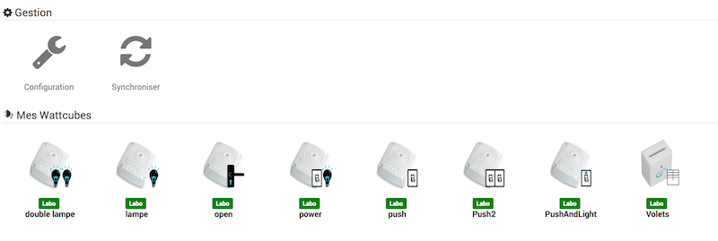
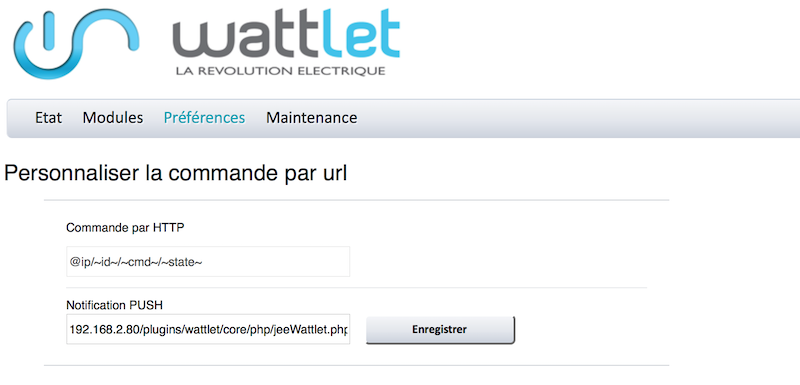

This plugin allows you to control Wattlet's Wattcubes modules via the
Wattcube Web.

Plugin configuration 
=======================

After downloading the plugin, you just need to activate it,
then configure the IP address of the Wattcube Web.

Equipment configuration 
=============================

The synchronization of Wattlets equipment is accessible from the
Plugins menu :

Once you click on one of them, you get :

Here you find all the configuration of your equipment :

-   **Name of the wattlet equipment** : name of your Wattlet equipment
    on Dashboard,

-   **Parent object** : indicates the parent object to which belongs
    equipment,

-   **Activate** : makes your equipment active,

-   **Visible** : makes your equipment visible on the dashboard,

-   **Category** : category of your Wattlet equipment

As well as the following information :

-   **Address** : Module address,

-   **Type** : Wattlet module type,

-   **Software version** : Module internal software version
    Wattlet,

-   **Hardware version** : Hardware version

> **NOTE**
>
> Orders are automatically created, there is no need to
> add them manually.

Wattcube Web configuration 
=============================

In order to retrieve status returns, it is necessary to configure
Push notifications in the Wattcube Web.

In the Wattcube Web interface, go to the "Preferences" tab"
then menu "Customization of the order"
image::../images/wattlet4.png \ [\]

In the "PUSH Notification" area, enter the Jeedom address under the
form :

**IP\_JEEDOM / plugins / wattlet / core / php / jeeWattlet.php?id = ~ id ~ & cmd = ~ cmd ~ & state = ~ state ~**

then save.

