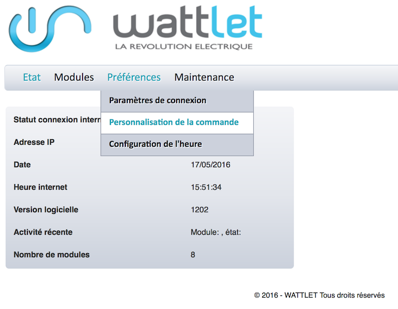

# Plugin Wattcube

Ce plugin permet de piloter les modules Wattcubes de Wattlet via le Wattcube Web.

# Configuration du plugin 

Après téléchargement du plugin, il vous suffit juste d’activer celui-ci, puis de configurer l’adresse IP du Wattcube Web.

# Configuration des équipements 

La synchronisation des équipements Wattlets est accessible à partir du menu Plugins :

Une fois que vous cliquez sur l’un d’eux, vous obtenez :

Vous retrouvez ici toute la configuration de votre équipement :

-   **Nom de l’équipement Wattlet** : nom de votre équipement Wattlet sur le dashboard,
-   **Objet parent** : indique l’objet parent auquel appartient l’équipement,
-   **Activer** : permet de rendre votre équipement actif,
-   **Visible** : rend votre équipement visible sur le dashboard,
-   **Catégorie** : catégorie de votre équipement Wattlet

Ainsi que les informations suivantes :

-   **Adresse** : Adresse du module,
-   **Type** : Type de module Wattlet,
-   **Version Software** : Version du logiciel interne du module Wattlet,
-   **Version Hardware** : Version du matériel

> **Note**
>
> Les commandes sont automatiquement créées, il n’est pas nécessaire de les rajouter manuellement.

# Configuration du Wattcube Web 

Afin de récupérer les retours d’états, il est nécessaire de configurer les notifications Push dans le Wattcube Web.

Dans l’interface du Wattcube Web, se rendre dans l’onglet "Préférences" puis menu "Personnalisation de la commande"

Dans la zone "Notification PUSH", entrer l’adresse de la Jeedom sous la forme :

**IP\_JEEDOM/plugins/wattlet/core/php/jeeWattlet.php?id=~id~&cmd=~cmd~&state=~state~**

puis enregistrer.

