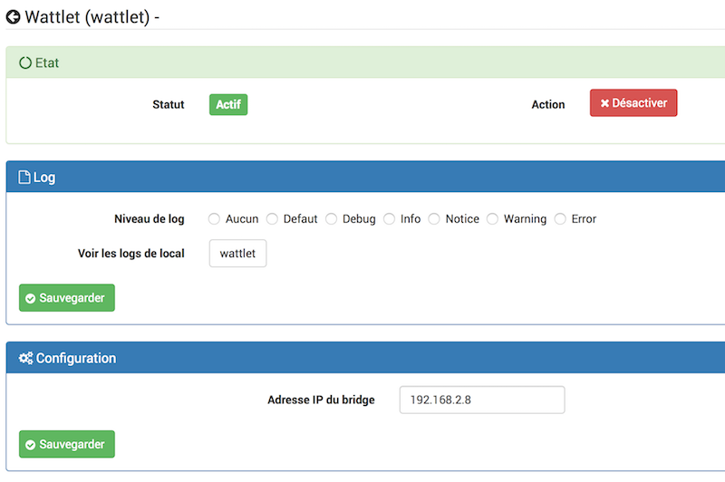
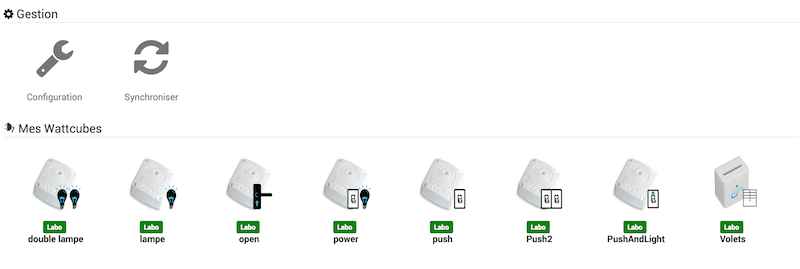
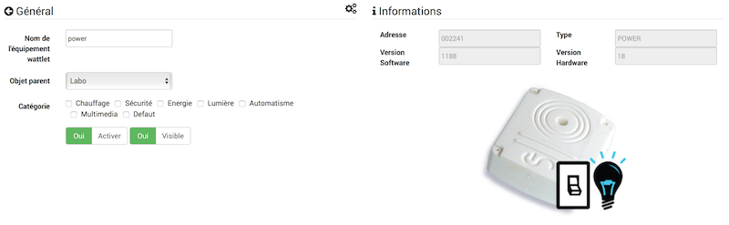
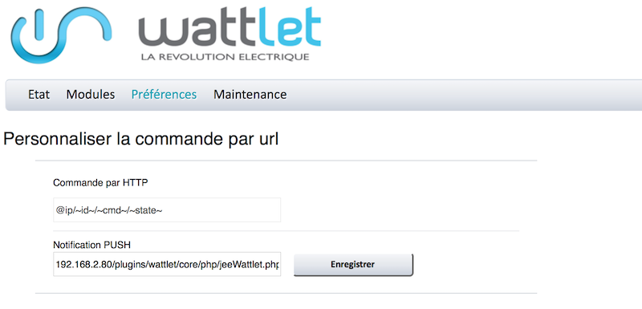

Este plugin permite que você controle os módulos Wattcubes do Wattlet através do
Wattcube Web.

Configuração do plugin 
=======================

Depois de baixar o plugin, você só precisa ativá-lo,
depois configure o endereço IP da Wattcube Web.

Configuração do equipamento 
=============================

A sincronização do equipamento Wattlets é acessível a partir do
Menu de plugins :

Depois de clicar em um deles, você obtém :

Aqui você encontra toda a configuração do seu equipamento :

-   **Nome do equipamento da wattlet** : nome do seu equipamento Wattlet
    no painel,

-   **Objeto pai** : indica o objeto pai ao qual pertence
    o equipamento,

-   **Ativar** : torna seu equipamento ativo,

-   **Visivél** : torna seu equipamento visível no painel,

-   **Categoria** : categoria do seu equipamento Wattlet

Bem como as seguintes informações :

-   **Morada** : Endereço do módulo,

-   **Tipo** : Tipo de módulo Wattlet,

-   **Versão do software** : Versão interna do software do módulo
    Wattlet,

-   **Versão de hardware** : Versão de hardware

> **NOTA**
>
> Os pedidos são criados automaticamente, não há necessidade de
> adicione-os manualmente.

Configuração da Web do Wattcube 
=============================

Para recuperar retornos de status, é necessário configurar
Notificações por push na Web do Wattcube.

Na interface da Web do Wattcube, vá para a guia "Preferências""
depois no menu "Personalização do pedido"
image::../images/wattlet4.png \ [\]

Na área "Notificação por push", digite o endereço Jeedom sob o
forma :

**IP\_JEEDOM / plugins / wattlet / core / php / jeeWattlet.php?id = ~ id ~ & cmd = ~ cmd ~ & state = ~ state ~**

então salve.

